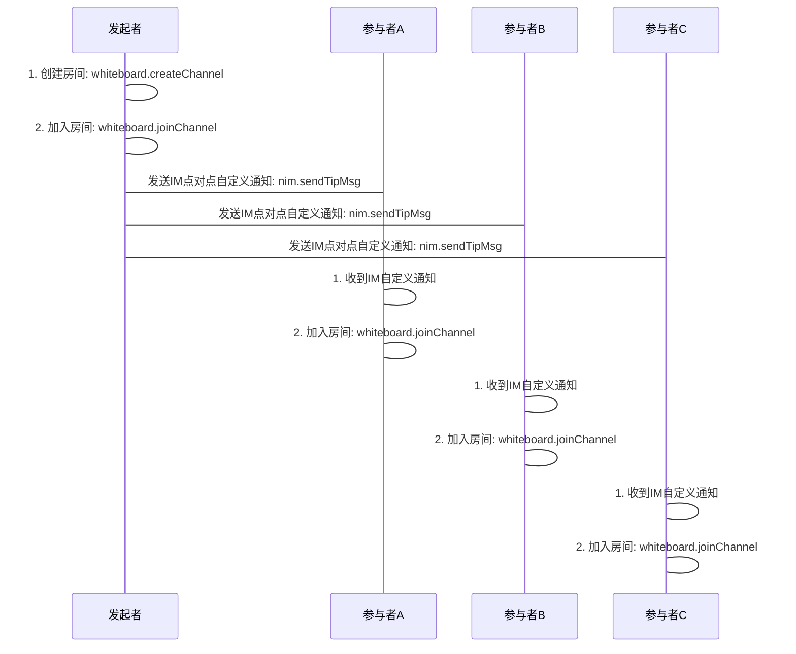

# <span id="多人互动白板">多人互动白板</span>

通过阅读本章节，您将快速了解多人互动白板的相关功能，并且能通过本章节中介绍的流程和接口快速搭建多人互动白板会话。

多人互动白板，顾名思义，参与互动白板的有多人，SDK 提供多人互动白板从创建白板会话、加入会话、会话互动到解散会话整个过程的能力，包括创建多人白板会话、发送白板数据、结束白板等基础能力接口与异常流程控制与回调。 多人互动白板不配套提供语音通道，如果需要，可以与多人音视频通话功能结合使用，方便灵活满足各类音视频与白板相结合的多人场景。

与点对点实时互动白板的流程不同，多人互动白板`暂不支持`**呼叫**、**推送**和**挂断**等服务，只提供基本的**创建**、**加入**和**离开**白板会话接口。

多人互动白板也不配套提供语音通话通道，如果需要，可以与多人会议功能组合使用。多人互动白板的主要流程如下：

## <span id="多人白板接入流程">多人白板接入流程</span>



### <span id="创建多人互动白板">创建多人互动白板</span>

* API 介绍

创建一个多人互动白板会话，以会话名标识。创建成功后，本人和其他人才可以使用该会话名加入同一白板会话。

* 示例

```js
whiteboard.createChannel({
  channelName: 'testChannelName' //必填
  custom: '测试自定义数据' //可选
}).then(function(obj) {
  // 预定房间成功后的上层逻辑操作
  // eg: 初始化房间UI显示
  // eg: 加入房间
})
```

* 参数说明

| 参数名      |   类型 |                                                 说明 |
| :---------- | -----: | ---------------------------------------------------: |
| channelName | string |               房间房号，可以任意英文字母和数组的组合 |
| custom      | string | 扩展字段，在通话的创建和加入之间传递自定义的额外信息 |

### <span id="加入多人互动白板">加入多人互动白板</span>

* API 介绍

创建多人互动白板会话成功后，本人和其他人可以使用创建时的名称，通过该接口加入会话。

```js
const sessionConfig = {
  color: '#aaa',
  width: 200,
  height: 200,
  record: false,
  // 绘画模式
  mode: 'free'
};
whiteboard
  .joinChannel({
    channelName: 'testChannelName', //必填
    type: Netcall.NETCALL_TYPE_VIDEO,
    sessionConfig: sessionConfig
  })
  .then(function(obj) {
    // 加入房间成功后的上层逻辑操作
  });
```

* 参数说明

| 参数名        |   类型 |                                                                                                                                                                  说明 |
| :------------ | -----: | --------------------------------------------------------------------------------------------------------------------------------------------------------------------: |
| channelName   | string |                                                                                                                                房间房号，可以任意英文字母和数组的组合 |
| type          | number |                                                                                                                                              房间通话类型，音频、视频 |
| sessionConfig | object | 通话配置, 每次通话会伴随着一次通话, 可以对此次通话进行一些配置,[具体属性见这里](/docs/product/音视频通话/SDK开发集成/Web开发集成/总体参数说明?#sessionConfig多人通话) |

### <span id="用户加入多人互动白板通知">用户加入多人互动白板通知</span>

* API 介绍

  * 多人通话中，加入多人房间后，如果有用户加入了当前房间，当前房间中的所有人都会收到该通知，做出相应处理
    * 开启新加入的用户的视频画面显示

* 示例

```js
whiteboard.on('joinChannel', function(obj) {
  // 通知上层有其他用户加入了房间，上层做相应逻辑和UI处理
  console.log('joinChannel', obj);
});
```

* 参数说明

obj 为通知消息对象

| obj 属性  |   类型 |               说明 |
| :-------- | -----: | -----------------: |
| account   | string | 新加入同伴的 accid |
| channelId | number |      加入的房间 id |

### <span id="用户离开多人互动白板通知">用户离开多人互动白板通知</span>

* API 介绍
  * 多人通话中，加入房间后，如果有同伴离开房间，当前房间里的所有人都会收到该同伴离开会议的通知，开发者可以根据该通知做出相应处理
* 示例

```js
whiteboard.on('leaveChannel', function(obj) {
  // 通知上层有其他用户离开了会议，上层做相应逻辑和UI处理
  console.log('leaveChannel', obj);
});
```

* 参数说明

obj 为通知消息对象

| obj 属性  |   类型 |             说明 |
| :-------- | -----: | ---------------: |
| account   | string | 离开同伴的 accid |
| channelId | number |    离开的房间 id |

* 具体方法说明

| 返回类型 |                      方法名 |                                                                                              说明 |
| :------- | --------------------------: | ------------------------------------------------------------------------------------------------: |
| promise  | whiteboard.stopRemoteStream | [停止预览对方视频画面](/docs/product/音视频通话/SDK开发集成/Web开发集成/播放?#停止预览远程视频流) |

### <span id="改变自己在房间中的角色">改变自己在房间中的角色</span>

* API 介绍
  * 在多人房间模式中，可以通过该方法切换自己的房间中的角色，有以下两种

| 角色     |                               说明 |
| :------- | ---------------------------------: |
| player   | 互动者，可以绘图并且发送自己的数据 |
| audience | 观众，不能绘图，不能发送自己的数据 |

* 示例

```js
// 切换为互动者
whiteboard.changeRoleToPlayer().then(function(obj) {
  console.log('切换成功，当前角色', obj);
});

// 切换为观众
whiteboard.changeRoleToAudience().then(function(obj) {
  console.log('切换成功，当前角色', obj);
});
```

### <span id="绘图相关设置">绘图相关设置</span>

#### <span id="动态设置canvas容器">动态设置 canvas 容器</span>

* API 介绍

  * 单页应用中，很容易发生 dom 丢失的情况，通过该方法可以动态设置 canvas 容器

* 示例

```js
whiteboard.setContainer(node);
```

#### <span id="动态设置绘图颜色">动态设置绘图颜色</span>

* API 介绍

  * 绘图过程中，可以动态更改绘图颜色色值

* 示例

```js
whiteboard.setColor('#aaa');
```

* 特殊说明
  * 对于 16 进制的色值，如果有前缀为 0 的情况，对端在收到色值后，解析会有问题！

#### <span id="动态设置绘图模式">动态设置绘图模式</span>

* API 介绍

  * 绘图过程中，可以动态更改绘图模式，目前只支持以下两种模式
  * flag: 激光笔模式
  * free: 自由绘图模式

* 示例

```js
// 激光笔模式
whiteboard.setDrawMode('flag');
// 自由绘图模式
whiteboard.setDrawMode('free');
```

#### <span id="动态设置canvas背景">动态设置 canvas 背景</span>

* API 介绍

  * 通过该方法可以动态设置 canvas 背景，教育场景很常见
  * 请配合 IM 文档功能 一起使用

* 示例

```js
whiteboard.image({
  url: 'http://dev.netease.im/images/logo2.png', // 背景图地址
  docId: '文档ID',
  pageCount: '总页数',
  currentPage: '当前页数'
});
```

#### <span id="取消背景图设置">取消背景图设置</span>

* API 介绍

  * 通过该方法可以取消背景图设置

* 示例

```js
whiteboard.clearImage();
```

#### <span id="主动同步">主动同步</span>

* API 介绍

  * 如果不小心从一个房间异常退出，重新进去之后，可以通过该方法主动同步房间里的所有人清空所有笔记

* 示例

```js
whiteboard.syncBegin();
```

#### <span id="同步请求">同步请求</span>

* API 介绍

  * 如果不小心从一个房间异常退出，重新进去之后，可以通过该方法向房间里的某个人发出同步请求，对方收到请求后，会同步当前所有笔记给自己

* 示例

```js
whiteboard.syncRequest(account);
```